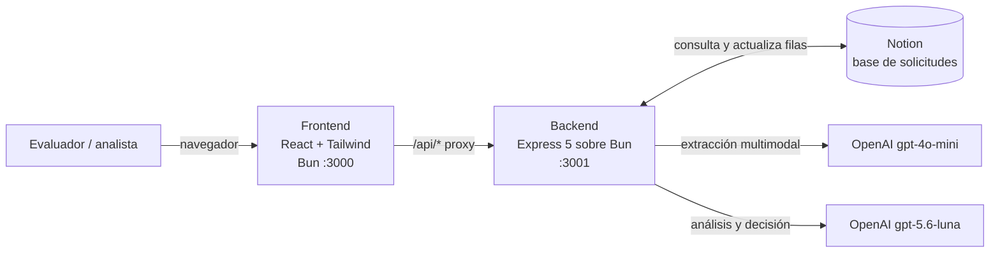

# Pre-Auth Agent

Agente de IA que evalúa **solicitudes de pre autorización quirúrgica**. Lee el informe médico y la póliza del paciente, verifica la cobertura y el período de carencia, y deja la decisión (**Pre Aprobada**, **Rechazada** o **Documentos Faltantes**) con su justificación directamente en Notion.

Proyecto desarrollado para el **Reto #1 del hackIAthon Panamá**.

---

## Índice

1. [El problema](#el-problema)
2. [Qué hace el agente](#qué-hace-el-agente)
3. [Cómo probarlo en 3 minutos](#cómo-probarlo-en-3-minutos)
4. [Cómo decide la IA](#cómo-decide-la-ia)
5. [Arquitectura](#arquitectura)
6. [Privacidad de los datos](#privacidad-de-los-datos)
7. [API](#api)
8. [Ejecutarlo en local](#ejecutarlo-en-local)
9. [Despliegue](#despliegue)
10. [Estructura del repositorio](#estructura-del-repositorio)

---

## El problema

Antes de una cirugía programada, la aseguradora debe revisar manualmente cada solicitud de pre autorización: leer el informe médico, localizar en la póliza si el procedimiento está cubierto o excluido, y calcular si ya se cumplió el período de carencia desde el inicio de vigencia. Es un trabajo lento, repetitivo y propenso a errores, y cada día de demora retrasa la atención del paciente.

## Qué hace el agente

1. **Recibe la solicitud en Notion.** Cada fila de la base de datos es una solicitud con el titular, el informe médico (PDF o imagen) y la póliza.
2. **Extrae los datos de los documentos** con un modelo multimodal y los convierte en datos estructurados: paciente, diagnóstico (CIE-10), procedimiento (CPT), fechas, coberturas, exclusiones y períodos de carencia.
3. **Analiza la solicitud** con un modelo de razonamiento que aplica las reglas de decisión de la aseguradora.
4. **Escribe el resultado en Notion**: cambia el `Status` y redacta la `Respuesta` citando las cláusulas aplicables.
5. **Borra del servidor** los archivos temporales usados en el análisis.

Desde la interfaz web el evaluador puede:

- Ver todas las solicitudes, separadas en las pestañas **Pendientes** y **Procesadas**.
- **Procesar** una solicitud y seguir el avance paso a paso con una barra de progreso real (descarga → extracción → análisis → guardado en Notion).
- **Descargar** el informe médico y la póliza de cada solicitud.
- **Limpiar** una solicitud procesada para devolverla a *En revision* y volver a analizarla.
- Abrir la tabla de Notion con el botón **Ver en Notion**.

## Cómo probarlo en 3 minutos

1. Abre el [agente en ejecución](https://pre-auth-agent.arnebin.dev).
2. En la pestaña **Pendientes**, pulsa **Procesar solicitud** en cualquier solicitud y observa la barra de progreso.
3. Al terminar, la vista cambia a **Procesadas** y muestra la decisión con su justificación.
4. Pulsa **Ver en Notion** y comprueba que el `Status` y la `Respuesta` se actualizaron en la base de datos.
5. Descarga los documentos de la solicitud para contrastar la decisión con el informe y la póliza originales.
6. Pulsa **Limpiar** para devolver la solicitud a Pendientes y repetir la prueba.

> Mientras una solicitud se procesa, los demás botones quedan bloqueados para evitar análisis simultáneos de la misma solicitud.

## Cómo decide la IA

El análisis se hace en dos etapas, ambas con **salidas estructuradas validadas con Zod**, así que el modelo no puede devolver un formato distinto al esperado.

| Etapa | Modelo | Entrada | Salida |
| --- | --- | --- | --- |
| Extracción | `gpt-4o-mini` (multimodal) | PDFs o imágenes del informe y la póliza | JSON del informe médico y de la póliza (`server/schemas/extraction.ts`) |
| Análisis | `gpt-5.6-luna` | JSON extraído + fecha de la solicitud | Decisión, cobertura, carencia y justificación (`server/schemas/analysis.ts`) |

Las reglas se aplican en este orden (`server/services/ai.ts`):

1. **Documentos Faltantes**: falta o es ilegible un dato indispensable (procedimiento, inicio de vigencia, coberturas, cláusula de carencia o identidad del paciente). Se listan los datos que faltan.
2. **Rechazada**: el procedimiento no está cubierto o está excluido, la carencia no se ha cumplido o la póliza no estaba vigente en la fecha de la solicitud.
3. **Pre Aprobada**: el procedimiento está cubierto y la carencia se cumplió (o no aplica).

Además, si a la solicitud le falta el informe médico o la póliza, se marca como *Documentos Faltantes* **sin llamar a la IA**. Para limitar las alucinaciones, el modelo debe basarse solo en los datos recibidos, citar las cláusulas aplicables y calcular explícitamente el tiempo transcurrido.

Formato de la respuesta que se guarda en Notion (ejemplo ilustrativo):

```text
Resultado: Rechazada
Cobertura: Cirugía cubierta.
Período de carencia: Solo han transcurrido 6 de 10 meses.
Justificación: No cumple el período de carencia.
```

## Arquitectura



El progreso se envía en tiempo real como NDJSON (una línea JSON por paso). Si algo falla, se restaura el estado anterior en Notion y el error aparece en la tarjeta de la solicitud.

**Stack:** Bun 1.3, TypeScript, React 19, Tailwind CSS 4, shadcn/ui, Express 5, OpenAI SDK (Responses API), Zod 4, Notion SDK 5, Docker Compose, Cloudflare Tunnel y GitHub Actions.

## Privacidad de los datos

Los informes médicos y las pólizas son datos sensibles, así que el diseño evita que persistan fuera de Notion:

**Nota:** Somos conscientes de que, en un entorno de producción, la privacidad de los datos es crítica y ningún dato debería enviarse a un proveedor externo como OpenAI. Sin embargo, al tratarse de un prototipo, y por motivos de tiempo y practicidad, optamos por usar la API de OpenAI para construir los agentes.

## API

Todas las rutas cuelgan de `/api`. Los errores devuelven `{ "error": "mensaje" }` con el código HTTP correspondiente.

| Método | Ruta | Descripción |
| --- | --- | --- |
| `GET` | `/api/health` | Estado del servicio. |
| `GET` | `/api/solicitudes` | Lista todas las solicitudes de Notion. |
| `GET` | `/api/solicitudes/tabla` | URL (pública si existe) de la tabla de Notion. |
| `POST` | `/api/solicitudes/:id/process` | Procesa la solicitud. Responde en NDJSON: `{ paso }` por etapa y al final `{ resultado }` o `{ error }`. `404` si no existe y `409` si ya se está procesando. |
| `POST` | `/api/solicitudes/:id/limpiar` | Reinicia `Status` a *En revision* y vacía `Respuesta`. `409` si se está procesando. |
| `GET` | `/api/solicitudes/:id/documentos/:tipo/:indice` | Descarga un documento. `tipo`: `informe-medico` o `poliza`; `indice` empieza en 0. |

## Ejecutarlo en local

### Requisitos

- [Bun](https://bun.com) 1.3 o superior.
- Una API key de OpenAI.
- Una integración de Notion con acceso a una base de datos con estas propiedades:

| Propiedad | Tipo | Valores |
| --- | --- | --- |
| `Titular` | Título | Nombre del paciente o titular. |
| `Informe Medico` | Archivos | PDF o imagen del informe médico. |
| `Póliza` | Archivos | PDF o imagen de la póliza. |
| `Status` | Estado | `En revision`, `Pre Aprobada`, `Rechazada`, `Documentos Faltantes`. |
| `Respuesta` | Texto | La completa el agente. |

### Variables de entorno

Crea `server/.env`:

```bash
OPENAI_API_KEY=sk-...
NOTION_API_KEY=ntn_...
NOTION_DATA_SOURCE_ID=id-de-la-fuente-de-datos-de-notion
PORT=3001
CLIENT_ORIGIN=http://localhost:3000
```

| Variable | Dónde | Descripción |
| --- | --- | --- |
| `OPENAI_API_KEY` | backend | Clave de OpenAI para extracción y análisis. |
| `NOTION_API_KEY` | backend | Token de la integración de Notion. |
| `NOTION_DATA_SOURCE_ID` | backend | Id de la fuente de datos (tabla) de solicitudes. |
| `PORT` | backend | Puerto del backend (por defecto `3001`). |
| `CLIENT_ORIGIN` | backend | Origen permitido por CORS (por defecto `http://localhost:3000`). |
| `BACKEND_URL` | frontend | URL del backend para el proxy `/api` (por defecto `http://localhost:3001`). |

### Comandos

```bash
bun install          # instala las dependencias de ambos workspaces
bun run dev          # frontend en http://localhost:3000 y backend en http://localhost:3001
```

| Comando | Descripción |
| --- | --- |
| `bun run dev` | Inicia frontend (con recarga en caliente) y backend. |
| `bun run dev:client` / `bun run dev:server` | Inicia solo uno de los dos. |
| `bun run build` | Build de producción del frontend en `client/dist`. |
| `bun run typecheck` | Comprueba los tipos de ambos workspaces. |
| `cd server && bun test` | Ejecuta los tests del backend. |

## Despliegue

La aplicación se despliega automáticamente con cada push a `main` (`.github/workflows/deploy.yml`):

1. Un runner self-hosted de GitHub Actions ejecuta `docker compose up -d --build`.
2. `docker-compose.yml` levanta tres servicios en una red privada: `frontend` (puerto 3000), `backend` (puerto 3001) y `cloudflared`.
3. **Cloudflare Tunnel** publica la aplicación en `https://pre-auth-agent.arnebin.dev` sin abrir puertos en el servidor. Ningún contenedor publica puertos al exterior, y el navegador llega al backend a través del proxy `/api` del frontend.
4. Los secretos (`OPENAI_API_KEY`, `NOTION_API_KEY`, `CLOUDFLARE_TUNNEL_TOKEN`) se inyectan desde GitHub Actions y nunca se incluyen en la imagen.

## Estructura del repositorio

```text
prior-auth-agent/
├── client/                         # Frontend (Bun + React)
│   └── src/
│       ├── index.ts                # Servidor Bun: sirve la app y hace de proxy de /api
│       ├── App.tsx
│       └── components/
│           ├── SolicitudesList.tsx     # Pestañas, procesamiento y barra de progreso
│           ├── DescargarDocumentos.tsx # Botones de descarga
│           └── LimpiarSolicitud.tsx    # Reinicio de una solicitud procesada
├── server/                         # Backend (Express 5 sobre Bun)
│   ├── index.ts                    # App, CORS y manejo de errores
│   ├── routes/                     # solicitudes.ts, documentos.ts
│   ├── services/
│   │   ├── pipeline.ts             # Orquesta descarga → extracción → análisis → Notion
│   │   ├── ai.ts                   # Reglas de decisión y modelo de análisis
│   │   ├── notion.ts               # Lectura y escritura en Notion
│   │   └── storage.ts              # Archivos temporales y su borrado
│   ├── middlewares/extractor.ts    # Extracción multimodal de los documentos
│   ├── schemas/                    # Esquemas Zod de extracción y análisis
│   ├── models/                     # Tipos de las páginas de Notion
│   └── tests/
├── docker-compose.yml
├── Dockerfile
└── .github/workflows/deploy.yml
```

Este proyecto fue desarrollado por el equipo **Fsociety** como parte del reto inicial de la cuarta edición del hackIAthon.